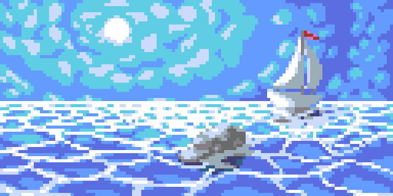
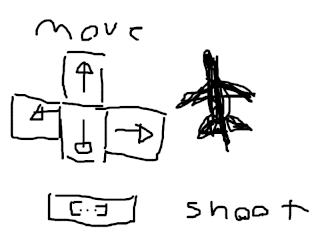

# Blue Plane Game Thing
A little retro shmup made in python.  
Its about little colourful jet fighters shooting each other.  
  
Guess which colour you play as.

## Table of contents
- [Controls](#controls)
- [To Do](#todo)
- [Credits](#credits)  
  

## Controls 
*This* ↘️  
  
Arrow keys to move, space to shoot.

## To Do 
**Not yet done**

- Start programming game base
- Finish base menu assets
- Impliment AI
- Add options menu
- Add title screen 
 
**Done**

- Basic player and enemy sprites
- Base ground texture

## Credits 
- Main graphics by [Outer](https://twitter.com/outertoaster)
- Programming by [Kety](https://twitter.com/ketyfolf)
- Temporary graphics from [opengameart.org](http://opengameart.org/)
- Music will likely be royalty free for a while, likely
 Evan Kings music until someone contributes something music wise
- Shit drawing of control scheme unfortunately also by Outer

