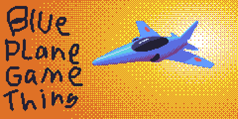

# Blue Plane Game Thing
A little retro shmup made in python.  
Its about little rainbow jet fighters shooting each other.  
  
Guess which colour you play as.

## Table of contents
- [Controls](#controls)
- [To Do](#todo)
- [Credits](#credits)  
  

## Controls 
*This* ↘️  
  
Arrow keys to move, space to shoot.

## To Do 
**Not yet done** ❌️

- Start programming game base
- Finish base menu assets
- Impliment enemies & enemy AI
- Add options menu
- Add title screen 
 
**Done** ✔️

- Basic player and enemy sprites
- Base ground texture

## Credits 
- Main Artist [Outer](https://twitter.com/outertoaster)
- Main Programmer - [Kety](https://twitter.com/ketyfolf)

- Temporary graphics from [opengameart.org](http://opengameart.org/)
- Music will likely be royalty free for a while, likely
 Evan Kings music until someone contributes something music wise
- Shit drawing of control scheme unfortunately also by Outer

